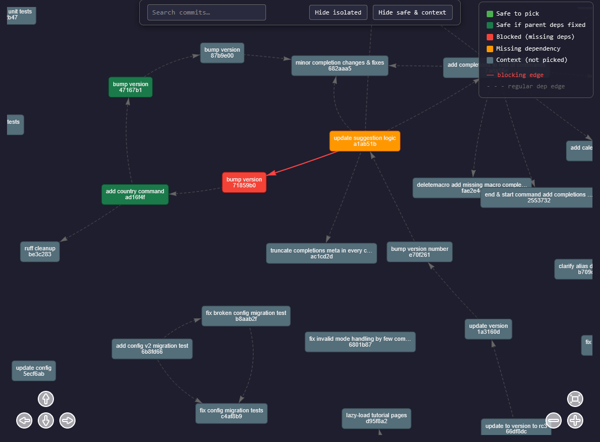

# git-trace


Visualize commit dependencies in a git repository. For a given branch (or commit
range) `git-trace` analyses every diff and reports which commits **depend** on
earlier ones, in the sense that they modify or remove lines previously added by
those earlier commits. The result is rendered as either a text tree, a plain
list, or an interactive HTML graph.

> **Disclaimer:** This tool was built specifically with single-branch analysis in mind.
> While it **might** work across divergent branches, your mileage may vary and
> I am not responsible for any inaccurate results if you choose to use it that way.

A secondary mode (`--picks`) treats the analysis as a cherry-pick safety check:
given a set of commit hashes you intend to pick, it tells you which are safe,
which are blocked by missing dependencies, and which would become "conditional"
on picking other commits as well.



## Installation

```bash
pip install git-trace
```

or from source:

```bash
git clone https://github.com/kiszkacy/git-trace
cd git-trace
pip install -e .
```

Requires Python 3.10+ and `git` available via `PATH`.

## Quick start

Run from inside a git repository:

```bash
git-trace                                  # analyse the full history of 'main'
git-trace dev                              # analyse 'dev' branch
git-trace dev --after abc1234              # only commits after a hash
git-trace dev --after abc --before def     # a commit range
git-trace --no-graph                       # skip HTML, print text only
git-trace --list                           # simplified list output + HTML graph
git-trace --list --no-graph                # simplified list output only
```

For cherry-pick analysis:

```bash
git-trace dev --picks h1 h2 h3             # check whether picks are safe
git-trace dev --picks picks.txt            # picks from a file
```

By default `git-trace` writes an interactive HTML graph to `./output.html` and
also prints a text summary to stdout.

## CLI arguments

| Argument | Description |
| --- | --- |
| `branch` | Branch to analyse. Defaults to `main`. Positional. |
| `--after HASH` | Only include commits *after* this hash (the hash itself is excluded). |
| `--before HASH` | Only include commits up to this hash (the hash itself is excluded). |
| `--whitelist HASH... \| FILE` | Restrict analysis to these hashes, or to a file containing hashes (one per line). Takes priority over `--blacklist`. Auto-loaded from `whitelist.txt` if present and the flag is omitted. |
| `--blacklist HASH... \| FILE` | Exclude these hashes from analysis, or a file containing hashes. Auto-loaded from `blacklist.txt` if present. |
| `--picks HASH... \| FILE` | Enable cherry-pick analysis. The given hashes are treated as the intended pick set; the tool reports safe / blocked / conditional picks. Auto-loaded from `picks.txt` if present. |
| `--ignore-paths PATH... \| FILE` | Repository-relative paths whose diffs should be ignored during analysis, or a file listing such paths. Auto-loaded from `ignore-paths.txt` if present. |
| `--repo DIR` | Path to the git repository root. Defaults to the current directory. |
| `--config FILE` | Path to a YAML config file. Defaults to `./config.yml`. |
| `--no-graph` | Skip HTML graph generation. |
| `--list` | Print a simple list of relevant commit hashes (one per line) instead of the formatted text tree. The HTML graph is still generated; combine with `--no-graph` to suppress it. |
| `--output PATH` | Path for the generated HTML graph. Defaults to `./output.html`. |
| `--txt-output PATH` | Also write the text output to this file. |
| `-v`, `--version` | Print version and exit. |

### Precedence rules

1. CLI arguments
2. `config.yml` values (if the file exists)
3. Auto-loaded files (`whitelist.txt`, `blacklist.txt`, `picks.txt`, `ignore-paths.txt`)

A more specific source overrides a less specific one
(i.e. CLI wins over config, config wins over auto-load).

## config.yml

If a file named `config.yml` exists in the current working directory it is
loaded automatically. Pass `--config FILE` to use a different path. Any CLI
option can be set there. Example:

```yaml
branch: dev
after: abc1234
ignore-paths:
  - vendor/
  - generated/
output: ./trace.html
no-graph: false
picks:
  - a1b2c3d
  - 9988776
```

Keys mirror the CLI flag names (use `-` not `_`). Values may be strings, lists,
or booleans depending on the option.

## Auto-loaded files

If you omit a flag, `git-trace` looks in the current directory for a matching
file and loads it automatically:

| File | Equivalent flag |
| --- | --- |
| `whitelist.txt` | `--whitelist` |
| `blacklist.txt` | `--blacklist` |
| `picks.txt` | `--picks` |
| `ignore-paths.txt` | `--ignore-paths` |

Each file holds one entry per line. Blank lines and lines starting with `#` are
ignored.

## Output

- **Formatted text** (default): a tree-style listing of commits and their
  dependencies, printed to stdout.
- **HTML graph** (default): an interactive force-directed graph written to
  `./output.html`. Open it in any browser.
- **`--list`**: a flat list of hashes (one per line), suitable for piping into
  other scripts. The HTML graph is still produced unless `--no-graph` is also specified.
- **`--txt-output FILE`**: also write the formatted text to a file.

In `--picks` mode the text output is grouped into `safe`, `blocked` (with the
list of missing dependencies for each) and `conditional` sections, while the HTML
graph highlights the pick set, blockers, and conditionals in distinct colors.

## How dependency detection works

`git-trace` uses a position-aware analyzer. For each commit it replays the
diff hunks against a virtual snapshot of every file, tracked as a list of
`(line_content, owning_commit)` pairs. When a later commit removes or
overwrites a line, the analyzer consults the owner stored for that exact
position and records a dependency on whichever earlier commit introduced
that line. Identical line content appearing in different places of a file is
correctly treated as independent.

The analyzer handles file creation, deletion (`+++ /dev/null`), renames
(`rename from` / `rename to`), and the `@@ -X,0 +Y,N @@` insertion hunks
correctly.

### Textual vs. Structural Dependencies

It is important to note that git-trace evaluates **purely textual dependencies**,
not structural or semantic ones. It only tracks modifications on a line-by-line basis.
It does not parse an Abstract Syntax Tree (AST) to understand code logic,
variable scopes, or function calls.

## Known limitations

- **Copies (`copy from` / `copy to`)** → a copied file is treated as a fresh
  new file rather than inheriting history from the source path. In practice
  this is rare since git rarely produces copy markers by default.
- **Binary files** are silently skipped → no dependency is recorded for
  changes to binary blobs.
- **Mode-only changes** (e.g. `chmod`) → are silently ignored, since they
  don't affect any tracked content.
- **Quoted paths in diffs** (`core.quotePath`) → git's `core.quotePath`
  setting (default: `true`) wraps file paths containing non-ASCII or special
  characters in backslash-escaped double quotes when producing diff output.
  The analyser reads paths literally after `+++ b/`, so a quoted path will
  not match its real on-disk name. If you analyse a repo with non-ASCII
  filenames, set `git config core.quotePath false` first.
- **`diff.noprefix` / `--no-prefix` diffs** → when `diff.noprefix` is
  enabled, git's diff output omits the `a/` and `b/` path prefixes (e.g.
  `--- file.txt` instead of `--- a/file.txt`). The analyser specifically
  looks for the `a/` and `b/` prefixes to identify files, so under that
  configuration no dependencies will be detected. Keep `diff.noprefix` at
  its default (`false`) when running `git-trace`.

## AI usage

LLM was used during the development of this project, specifically for:
- Writing the core dependency detection logic and processing the Git hunk headers.
- Injecting the custom HTML templates and dynamic styling payloads into pyvis html output.
- Generating most of the README.md content.

## License

MIT &mdash; see [LICENSE](LICENSE).
